# Asset Database & Trading System Web App

### Authors: Alexandra Qi, Yaodan Zhang, Jiajun Lin

A database-driven trading system built as part of a collaborative course project. This application integrates a **MySQL relational database** with a **Python Flask web-based GUI**, enabling users to interact with trading data through efficient SQL queries.

Note: All open-source data we used in this project came from yahoo!finance. The project was spoken highly of by the course professor during our final presentation.

## Project Overview
- **Database Layer**:  
  Relational schema designed via ER modeling and implemented in MySQL. Automated data ingestion from CSV datasets using Python.
  
- **Application Layer**:  
  A Python **Flask** web interface enabling dynamic SQL queries and interaction with trading data.

- **Documentation**:  
  Detailed design decisions, schema explanations, and usage instructions are provided in the `write_up/` folder.

## Getting Started

### Set Up the Database
Follow instructions in [`database/README.md`](./database/README.md) to:
- Create the MySQL schema.
- Load trading datasets via `DB_Insert.py`.

### Run the Web Application
Follow instructions in [`application/README.md`](./application/README.md) to:
- Configure database connection.
- Launch the Flask app for querying and interacting with data.

## Documentation
The [`write_up/`](./write_up/) folder contains:
- ER diagrams
- Schema explanations
- Project design rationale
- Sample queries and outputs

## Tech Stack
- **Backend**: Python, Flask
- **Database**: MySQL
- **Data Processing**: CSV, MySQL Connector/Python
- **Frontend**: HTML (via Flask templates)
- **Tools**: ER Modeling, SQL, Python Scripting

## License
This project was developed for academic purposes.

## Screenshots
### Part I. Asset Database

We used MySQL to build our asset database. We support three types of assets – stocks, indices, and ETFs. Below is the entity-relationship diagram of our database, where other components apart from asset classes relate to user interaction with the database which will be discussed later.

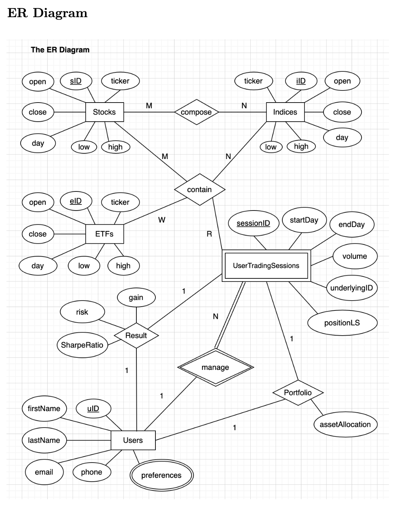

### Part II. Trading System App

Our trading system app mainly supports two functions. The first function is asset's price data lookup and its associated alphas' display (here "alphas" mean the technical indicators we selected as the representative features for an asset). When looking up the price data for an asset, we select the corresponding asset ticker as well as which timeframe we are interested in looking up.

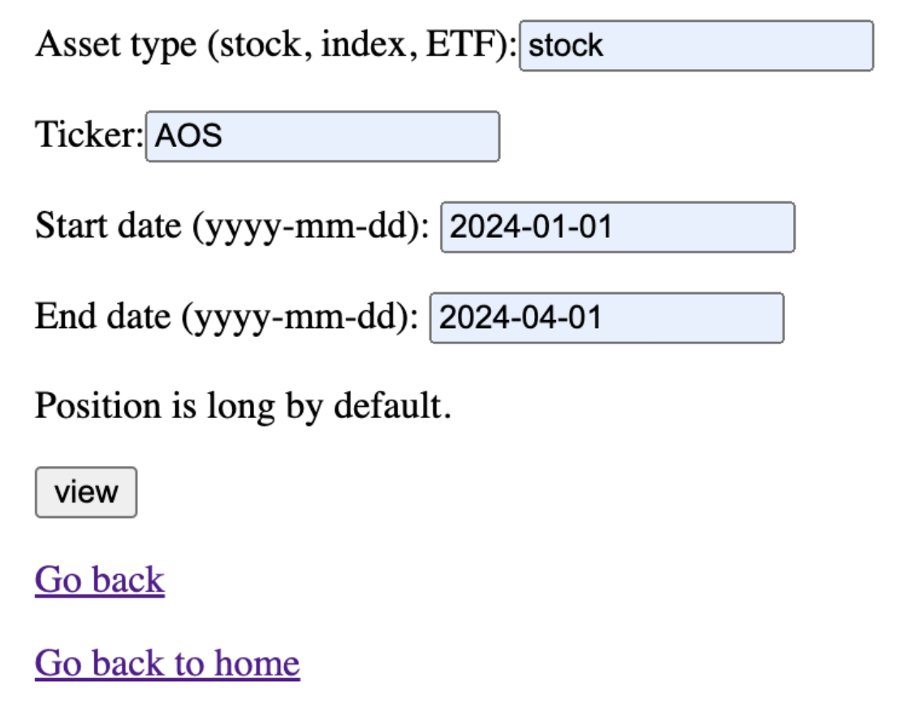

The result will be displayed on the screen, here the asset ticker is NVAX, and the time period for the lookup is from April 16th, 2024 to May 10th, 2024.

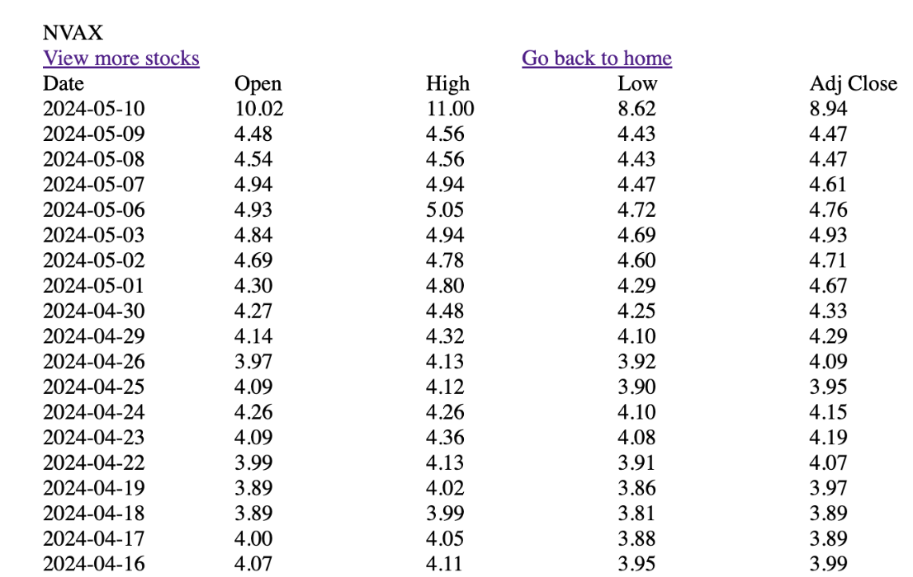

We can also select a timeframe to look up an asset's alphas in a similar way. The alphas will be displayed in the following way. Here the asset is AOS, the timeframe is from January 3rd, 2024 to March 25th, 2024, and the alphas we included are raw price movement, money flow multiplier, and the relative strength index. Those alphas are what we pre-selected which stay the same across all asset classes and tickers.

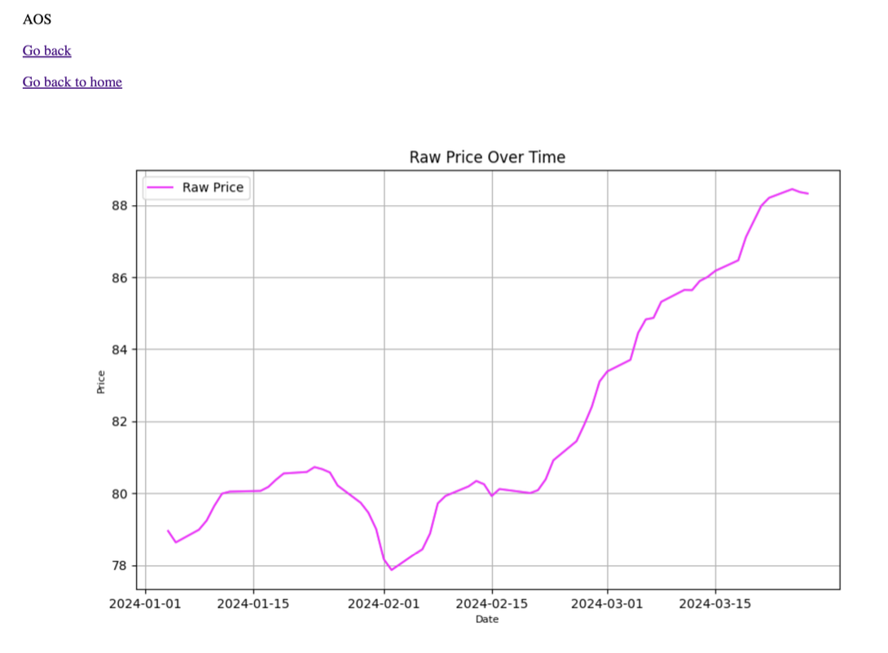

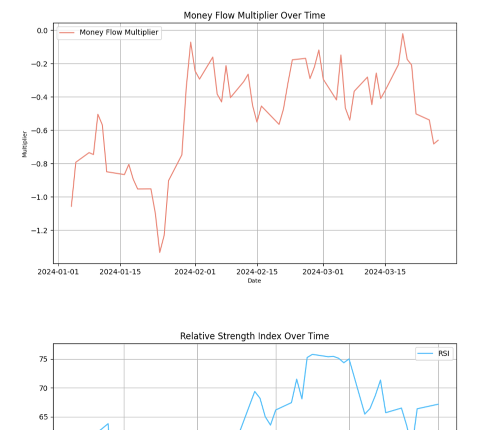

The second part of the app lies in the user interation with our database. From our main page, the user can find a sign up bottom which leads to a sign-up page.

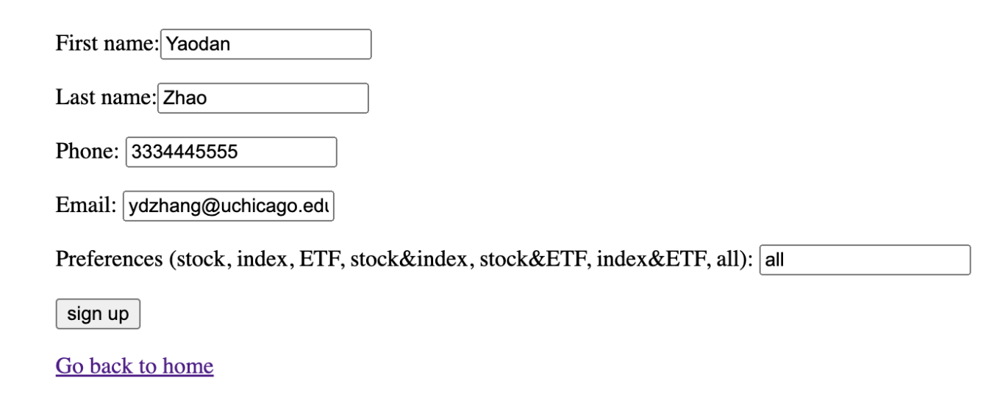

After signing up, the user can log in to his or her user's page. For example, below is user Jiajun Lin's page after he signs in.

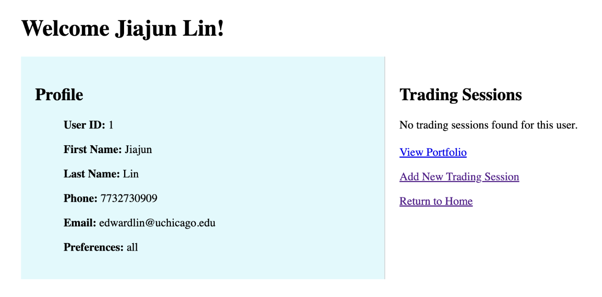

On the right lists all his mock trading sessions, we can see that Jiajun currently has no mock trading session, and he can create new mock trading session by clicking "Add New Trading Session" on the right.

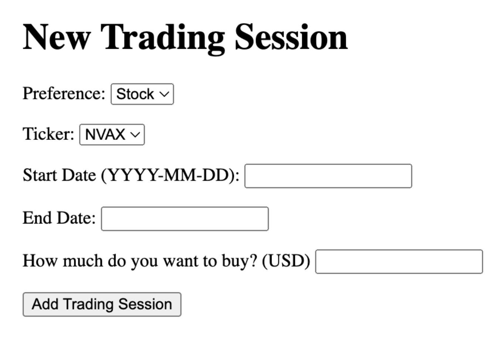

After adding this new trading session, it will be displayed on the user's page on the right below the "Trading Sessions" header. Session ID is a uniquely identifiable number for the trading session. Position means long (L) or short (S).

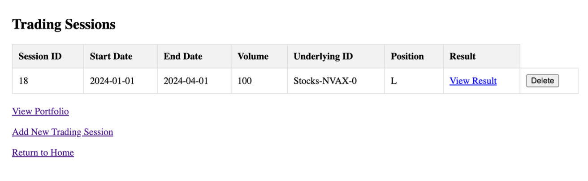

If clicking "View Result" for this session, the user can view the result as follows. The cumulative return graph is also visualized to the user.

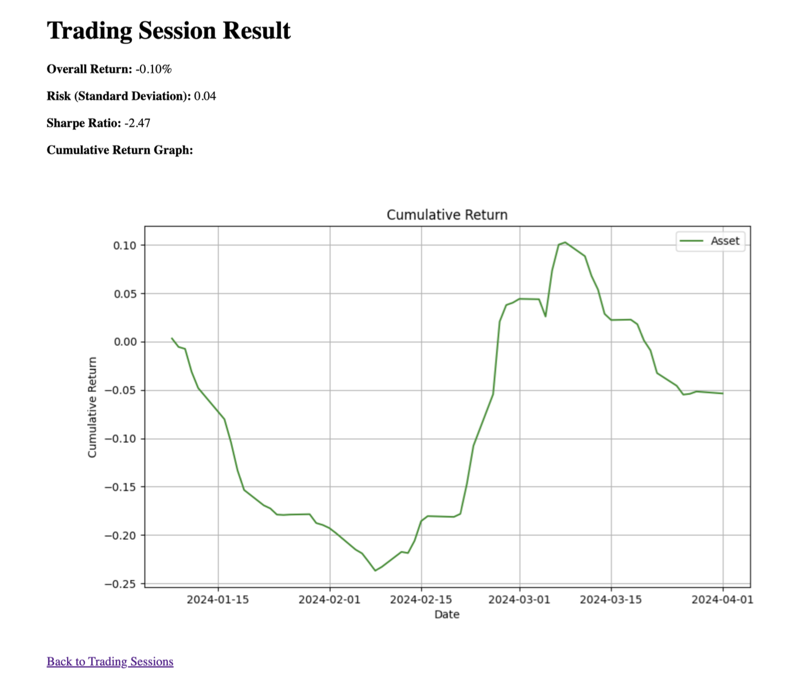

If more mock trading sessions are added, they will all be listed together under the "Trading Sessions" header on the user's page, and each session result is stored and ready to be viewed later. Moreover, the "View Portfolio" button leads to current portfolio weighted by each session's trading amount. Below is the portfolio infomation for the current user because the user only has one session.

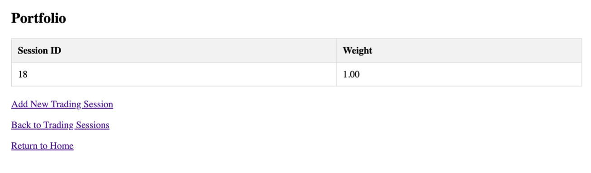
